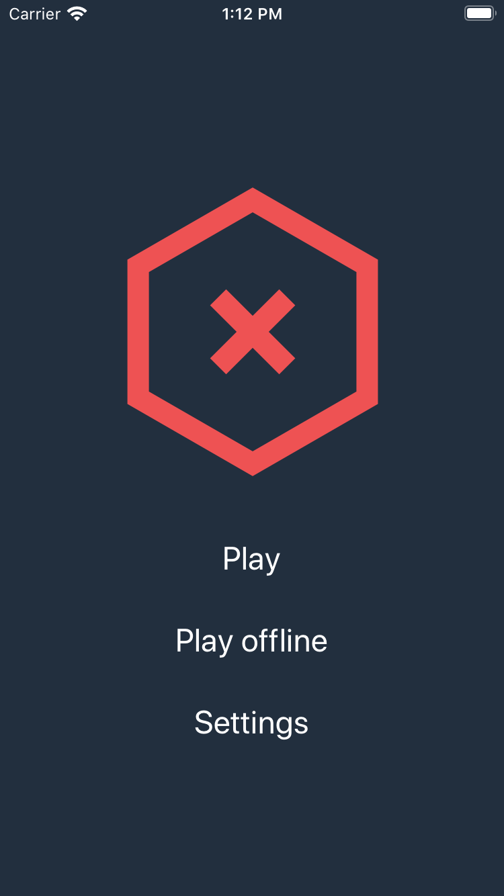
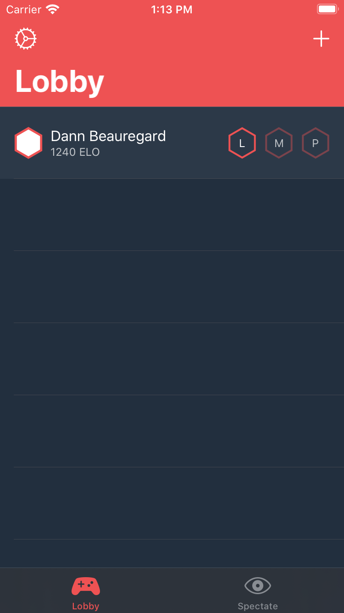
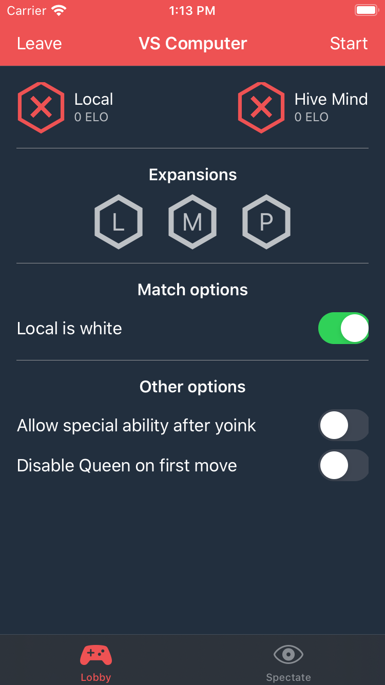
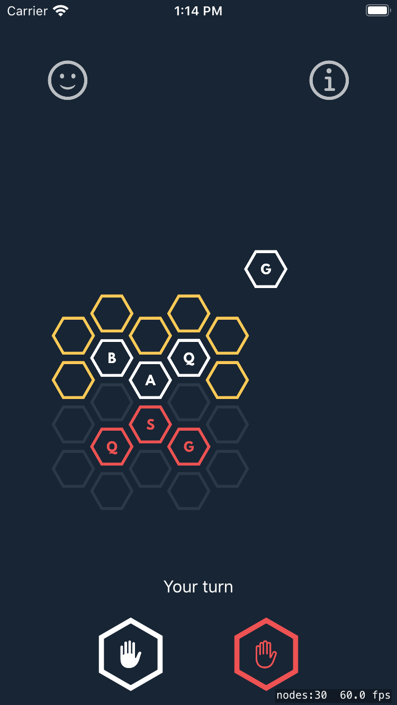
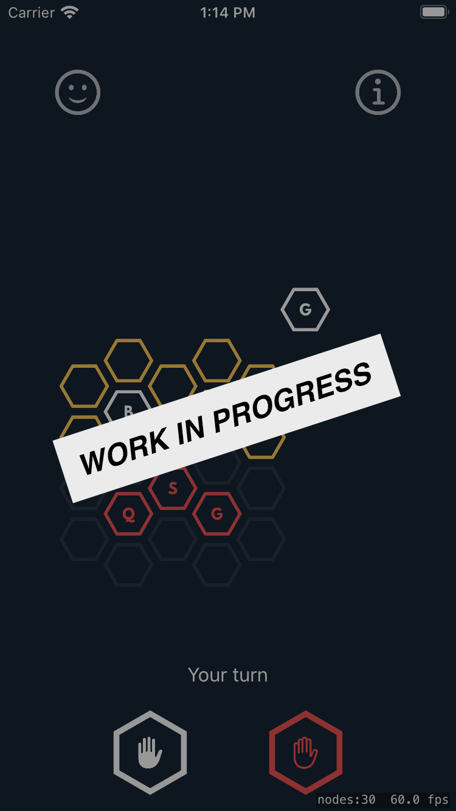
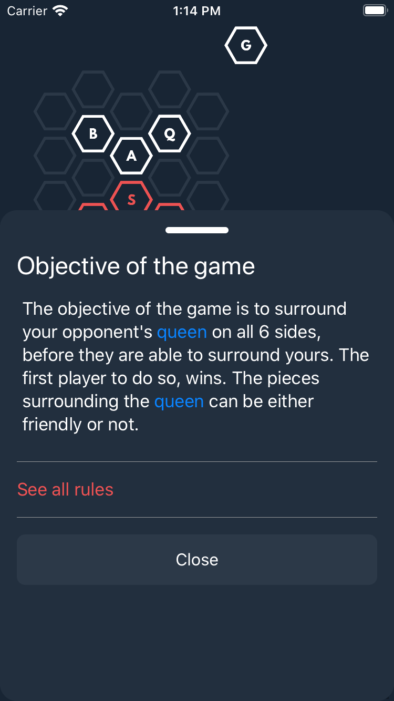

# Hive for iOS

Hive for iOS allows you to play a game of Hive against your friends.

Built with SwiftUI, SpriteKit, and ARKit.

- State managed by the [Hive Engine](https://github.com/josephroquedev/hive-engine)
- Built on the [Hive for Mobile Server](https://github.com/josephroquedev/hive-for-mobile-server)

To learn more about Hive, visit [Board Game Geek](https://www.boardgamegeek.com/boardgame/2655/hive)

## Screenshots

| Home                          | Lobby                           | Game Details                                 |
| ----------------------------- | ------------------------------- | -------------------------------------------- |
|  |  |  |

| 2D Game                            | AR Game                            | Overlay                             |
| ---------------------------------- | ---------------------------------- | ----------------------------------- |
|  |  |  |

## Contributing

### Requirements

- Swift 5.2+
- SwiftLint
- Xcode 11+

### Steps

1. You will need to follow the steps to run the [Hive for Mobile Server](https://github.com/josephroquedev/hive-for-mobile-server) locally
2. Fork and clone this repo
3. Write your changes
4. Run `swiftlint` for styling conformance
   - It should automatically run as you work in the Xcode project
5. Open a PR with your changes
