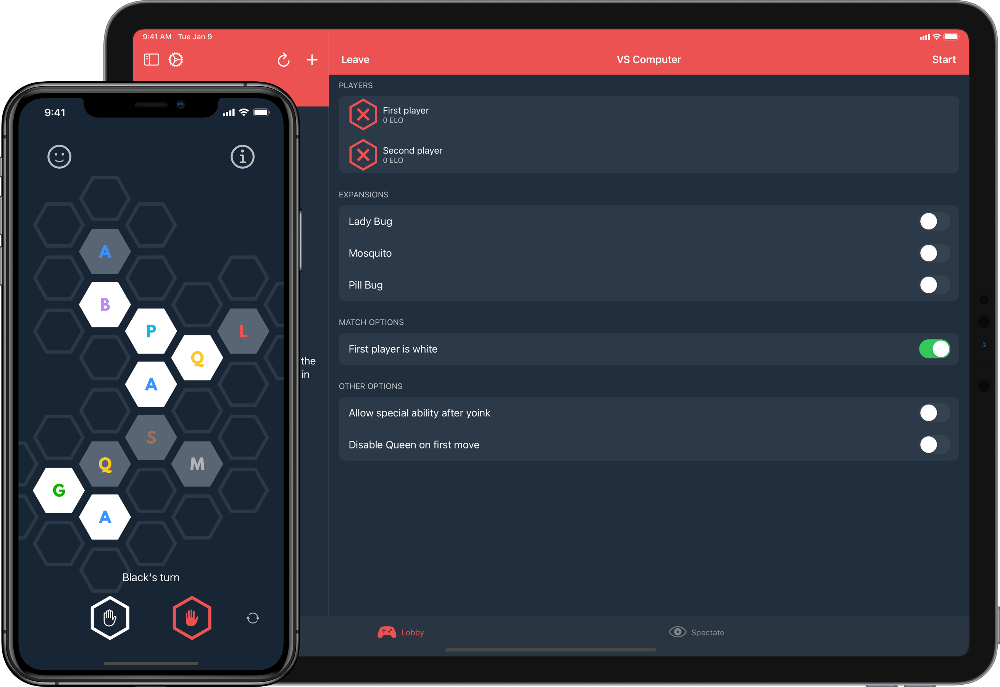

# Hive for iOS

Hive for iOS allows you to play a game of Hive against your friends.

Built with SwiftUI, SpriteKit, and ARKit.

- State managed by the [Hive Engine](https://github.com/autoreleasefool/hive-engine)
- Built on the [Hive for Mobile Server](https://github.com/autoreleasefool/hive-for-mobile-server)

To learn more about Hive, visit [Board Game Geek](https://www.boardgamegeek.com/boardgame/2655/hive)

## Screenshots

| Home                    | Lobby                     | Game Details                           |
| ----------------------- | ------------------------- | -------------------------------------- |
|  |  |  |

| 2D Game                      | AR Game                      | Overlay                       |
| ---------------------------- | ---------------------------- | ----------------------------- |
|  |  |  |

## Contributing

### Requirements

- Swift 5.2+
- SwiftLint
- Xcode 11+

### Steps

1. You will need to follow the steps to run the [Hive for Mobile Server](https://github.com/autoreleasefool/hive-for-mobile-server) locally
2. Fork and clone this repo
3. Write your changes
4. Run `swiftlint` for styling conformance
   - It should automatically run as you work in the Xcode project
5. Open a PR with your changes

## Notice

Hive for iOS is not affiliated with Gen42 Games in any way.
